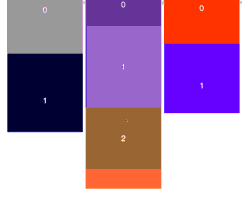

# react-blocks-scroll-sync &middot; [](https://www.npmjs.com/package/react-blocks-scroll-sync)


Synchronously scrolling multiple blocks.

## Install

``` shell
npm i --save react-blocks-scroll-sync
```

## Quick Overview
``` jsx
import React, { useCallback } from 'react'
import Container from 'react-blocks-scroll-sync'

const Block = Container.Block

const randomColor = () => {
  const r = Math.floor(Math.random() * 256)
  const g = Math.floor(Math.random() * 256)
  const b = Math.floor(Math.random() * 256)
  const color = `rgb(${r},${g},${b})`
  return color
}

const App = () => {
  const renderMultiBox = useCallback(() => {
    return new Array(100).fill(1).map((v, k) => {
      return (
        <div
          key={k}
          style={{
            width: 200,
            backgroundColor: randomColor(),
            height: Math.floor(Math.random() * 300) + 200
          }}
        >
          {k}
        </div>
      )
    })
  }, [])

  return (
    <div style={{ display: 'flex' }}>
      <Container>
        <Block>{renderMultiBox()}</Block>
        <Block>{renderMultiBox()}</Block>
        <Block>{renderMultiBox()}</Block>
      </Container>
    </div>
  )
}

export default App
```

<p align="center">
  
</p>

## Tips

⚠️ The number of child elements of each `<Block />` component need to be same.

